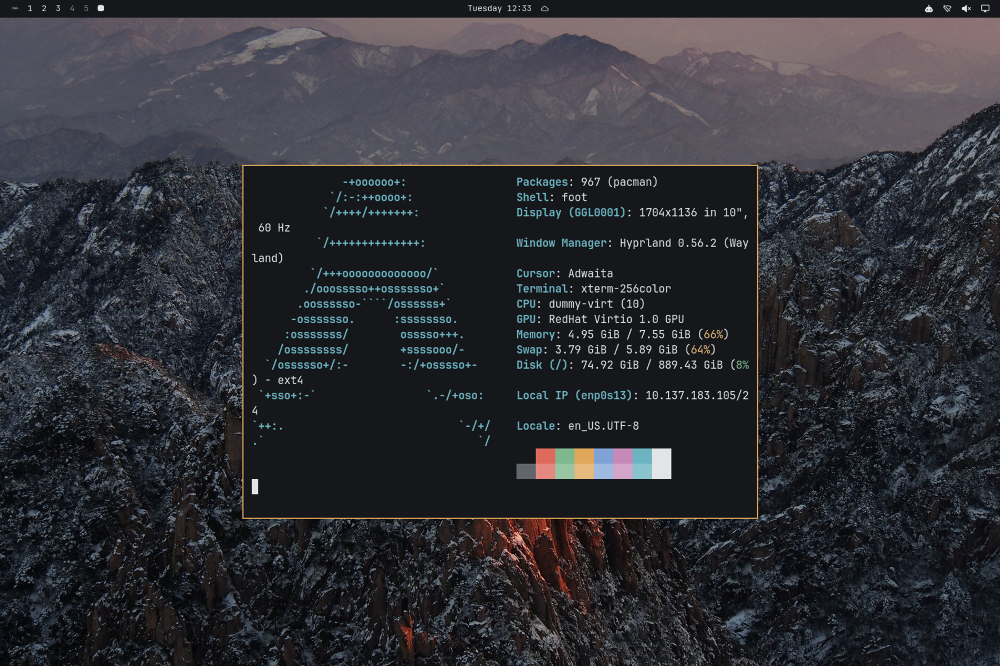

# 黄山·夜 Huangshan Night

夜山为底、云海白为字、日出金为印、松绿点缀的深色主题。壁纸：黄山雪峰、排云楼落日、暮色云海与屯溪老街雨夜。



## 安装

```bash
omarchy theme install https://github.com/rwanglq-ctrl/omarchy-huangshan-night-theme
```

## 壁纸来源

1. [Huangshan at sunrise in winter 2.jpg](https://commons.wikimedia.org/wiki/File:Huangshan_at_sunrise_in_winter_2.jpg) — Dcpeets，CC BY-SA 4.0（Wikimedia Commons）；已裁切、缩放
2. [Huangshan Paiyunlou sunset.jpg](https://commons.wikimedia.org/wiki/File:Huangshan_Paiyunlou_sunset.jpg) — Dcpeets，CC BY-SA 4.0（Wikimedia Commons）；已裁切、缩放
3. [屯溪老街雨夜](https://unsplash.com/photos/a-city-street-at-night-with-a-lot-of-lights-3JqDXpM2LE8) — J DDDD，Unsplash License（Unsplash）
4. [黄山暮色云海（二）](https://unsplash.com/photos/mountain-above-clouds-at-daytime-ksAz25aMhms) — Sherry Xu，Unsplash License（Unsplash）

## 许可

- 壁纸：Wikimedia Commons 照片按各自 CC 许可署名，改编版以 CC BY-SA 4.0 提供；Unsplash 照片依 Unsplash License 使用
- 配色与配置文件：MIT

详见 [LICENSE](LICENSE)。
